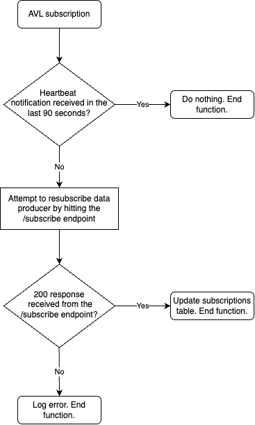

# AVL Feed Validator

### Overview

The purpose of this Lambda is periodically scan the active subscriptions, check that a heartbeat notification has been
received in the last 90 seconds. If a heartbeat notification has not been received then a new subscription request is
sent to the data producer to attempt to re-activate the feed. This function is scheduled to run every 30 seconds as that
is the frequency we expect to receive heartbeat notifications from a data producer.

The process flow this function follows is displayed below:



## Running this function

### Pre req:

- Ensure the setup steps in the root directory's README have been followed
- If you do not have a data producer setup in the environment you want to run this function in then create a mock data
  producer using the following make command:

```bash
make command-create-avl-mock-data-producer
```

To run this lambda yourself use the following make command:

```bash
make command-invoke-avl-feed-validator
```

