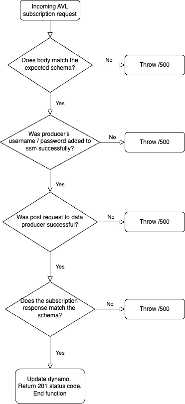

## AVL Subscriber Lambda

### Overview

The purpose of this Lambda is to handle the SIRI-VM subscription process when a data producer adds a new AVL feed via
the main BODS website.

It should also securely store auth credentials in parameter store and create an addition to the subscription DynamoDB
table so that we can keep an up-to-date record of AVL data feeds and their status.

### User Flow

On BODS a data producer can register an AVL Feed. They will go through the following two screens:

When a user submits their feed, it will be sent to this subscribe endpoint and will receive the following
information:

- URL for the data producer endpoint
- Description of the AVL feed
- Short description of the AVL feed
- Username
- Password
- RequestorRef (which is an optional field)

### Function Logic

The Lambda performs the following actions

1. Generates a subscription ID
2. Adds the AVL feed's username and password to parameter store
3. Generates a SIRI-VM subscription request
4. Sends the request to the data producer endpoint
5. Processes the response from the data producer endpoint
6. Store the subscription details in a DynamoDB table
    1. The subscription will have a status of "ACTIVE" if the subscription process was successful
    2. The subscription will have a status of "FAILED" if the subscription process failed

The following checks are made throughout the function:

