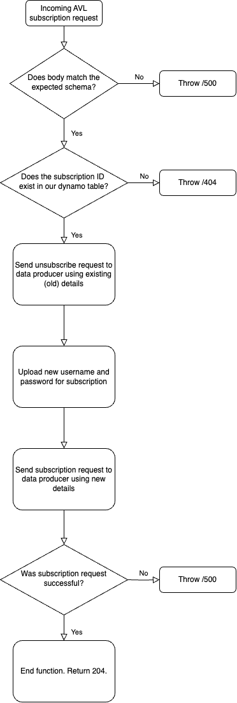

## AVL Update Subscription Lambda

### Overview

The purpose of this Lambda is to handle updating subscription details from a SIRI-VM AVL data producer.

For a given subscription it should:

- Attempt to unsubscribe from the data producer using the existing (old) details
- Upload new auth credentials to ssm
- Subscribe to data producer with new subscription details
- Update the AVL subscriptions table for that subscription with the new details and a `lastModifiedDateTime` field

### Function Logic

The following checks are made throughout the function:

