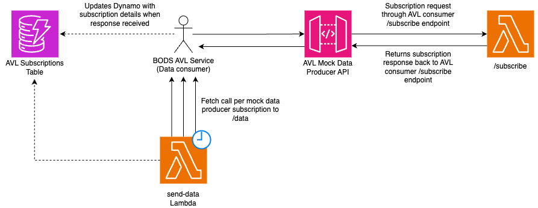

# AVL Mock Data Producer

## Overview

The purpose of this AVL mock data producer is to emulate the behaviour of a real AVL data producer to aid in testing the
end to end functionality of the bods AVL application.

This mock data producer has the following functions:

- Ability to handle a subscription request from the BODS AVL service
- Send mock AVL data to the BODS AVL Service's /data endpoint at regular intervals

### Subscribe Functionality

For background on the lifecycle for a SIRI-VM subscription see here:

- https://github.com/entur/anshar/blob/master/Subscription-lifecycle.md

The mock data producer should accept subscription requests from the BODS AVL service, generate a subscription response
and return this back to the requestor.

The BODS AVL service sends subscription requests to the mock data producer through its own /subscribe endpoint. When a
response is recieved from the mock data producer, the BODS AVL service /subscribe function will update a DynamoDB table
with the subscription details.

For the local environment, the subscribe lambda is invoked using a function URL. The reason for this is that
deploying Api Gateway V2 resources is a premium feature of localstack.

For all other environments, a mock data producer API gateway is created and the subscribe lambda is invoked using
/subscribe endpoint.

### Send Data Functionality

The purpose of the `send-data` lambda is to scan the AVL subscriptions table for active Mock Data Producer subscriptions
and for each individual subscription make a fetch call to the BODS AVL /data endpoint with some mock AVL data in the
body.

Currently, this lambda is triggered once every minute. (Future improvement is to trigger this Lambda once every 5
seconds to emulate the frequency of data in production)

